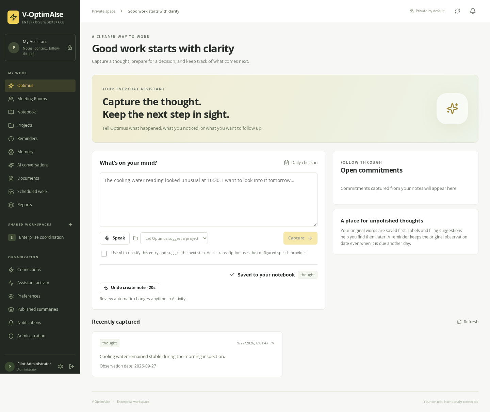

# V-OptimAIse 2.0

An enterprise assistant with personal capture and follow-up, governed team workspaces, grounded AI chat, scheduled analysis, and meeting preparation. This is the deployable product repository. PostgreSQL is the system of record, LangGraph orchestrates agent runs, and pgvector adds semantic retrieval within the same database.

The first deployment targets one enterprise on an **NVIDIA Jetson Orin Nano 8 GB**, using **Tailscale Serve** for private HTTPS. Generation and embeddings use OpenRouter. No GPU container runtime or local model download is needed.

## Laptop demo (Supabase/Neon + pgvector)

For stakeholder demos and feature testing on a laptop, without Docker, see **[docs/LOCAL_DEV.md](docs/LOCAL_DEV.md)**: one managed PostgreSQL database (Supabase or Neon) with pgvector for semantic search, and three OpenRouter model levels (Fast / Standard / Deep). Bash commands; Git Bash on Windows, Linux and macOS.

```bash
./scripts/local/setup.sh   # once
./scripts/local/start.sh   # http://localhost:8088
```

## Start the application

Prerequisites: a maintained 64-bit Linux host, Docker Engine with the Compose plugin, and Python 3.10+. On the Jetson, install and sign in to Tailscale and enable your tailnet's HTTPS capability first.

```bash
./scripts/start.sh --tailscale
```

The script asks for your OpenRouter key, creates a protected `.env` with random database credentials, a credential-encryption key and a first-run token, builds the app, applies migrations, starts services, and configures private Tailscale HTTPS. Open the printed address and enter the printed setup token to create your administrator account and enterprise. Testers must be connected to the approved tailnet.

For a local computer evaluation:

```bash
./scripts/start.sh --local
```

Open `http://localhost:8080` on that computer. The HTTP listener is bound to loopback; local HTTP mode is not a phone/LAN deployment. `--no-ai` permits a core-only installation without a model key. Existing `.env` files and database volumes are retained on repeated starts. An existing Tailscale Serve target is not silently reassigned.

After the first setup, create sites/units, provision their workspaces, assign members, publish a Workspace Brief, and upload operational documents. See the [user guide](docs/USER_GUIDE.md) for the three-person pilot.

## What an API key does and does not configure

| Capability | Required configuration |
| --- | --- |
| Text chat, reasoning, capture classification, meeting draft extraction | OpenRouter key; a permitted model with the required tool/structured-output capability |
| Semantic document search | OpenRouter key and embedding model/dimension settings; documents must permit external processing |
| Voice transcription | Separate speech-provider key; default adapter is an OpenAI-compatible hosted Whisper endpoint |
| Outlook calendar | Microsoft Entra application registration, client ID/secret, exact redirect URL, and each user's OAuth sign-in |
| Teams/Zoom transcript access | Provider permissions, eligible meeting/transcript availability, and authorized connection |
| Email delivery | Enterprise SMTP configuration |
| Teams delivery | Teams Workflows webhook configured in the app |
| InfluxDB readings | Reachable endpoint, organization/bucket selection, and a read-only token |

Cloud-account consent, enterprise application registration, and plant-network connectivity cannot be replaced by an OpenRouter key. Manual notes and supplied meeting minutes remain usable when those integrations are unavailable. Configuration values live in `.env`; connection credentials entered through the UI are encrypted in the database and never returned to the browser.

## Application preview



## Runtime and storage

| Component | Responsibility |
| --- | --- |
| Svelte 5 / Vite | Responsive single-origin web interface |
| FastAPI / SQLAlchemy / Alembic | Authentication, application services, repositories, migrations |
| PostgreSQL 16 + pgvector | Users, hierarchy, conversations, revisions, vector search, durable runs and checkpoints |
| LangGraph | Bounded context/model/tool/finalization flow |
| OpenRouter | Remote generation and approved embeddings |
| Scheduler process | Due work, reminders and personal routines |
| Executor process | Agent work and longer-running analysis |
| Connector process | Calendar synchronization and external delivery |
| Meeting process | Durable minutes extraction without delaying notifications |

The API and worker roles share one image and database. They do not require Redis, Kafka, a separate vector database, or a graph database. Workspaces are authorization/context boundaries, not database instances. The image runs as a non-root user with a read-only root filesystem; a named application-data volume is available for staging. Document originals are stored transactionally with document revisions in PostgreSQL.

## Operations

```bash
./scripts/diagnose.sh
./scripts/compose.sh logs --tail=100 api scheduler executor connectors meetings
./scripts/backup.sh
```

The backup pauses application writers, includes the database and application file volume, then resumes previously running services. Keep a separately protected `.env` copy: losing `CREDENTIAL_ENCRYPTION_KEY` prevents recovery of saved connection credentials. Restore accepts only a fresh database and empty file volume. See [operations](docs/OPERATIONS.md).

Do not use `docker compose down -v` to restart or upgrade: it deletes persistent volumes. Do not publish PostgreSQL, PLC, or historian ports. Tailscale provides private reachability; the app still enforces login and workspace roles.

## Documentation

- [Laptop demo with Supabase/Neon and pgvector](docs/LOCAL_DEV.md)
- [Jetson and Tailscale installation](docs/JETSON.md)
- [User guide and demonstration workflow](docs/USER_GUIDE.md)
- [Architecture and method map](docs/ARCHITECTURE.md)
- [Configuration, backup, restore and upgrades](docs/OPERATIONS.md)
- [Schema guide](docs/SCHEMA.md)
- [Validation and remaining deployment checks](docs/VALIDATION.md)
- [API and integration contract](CONTRACT.md)

The application is a single-enterprise, single-host pilot deployment. Physical Jetson execution, tenant-specific OAuth consent, paid provider responses, and plant connectivity must be verified with your actual hardware and accounts. The included native PostgreSQL/ARM64 CI recipes are release gates, not claims that remote CI has already run. The validation record distinguishes completed tests from those checks.

## Development

Use Python 3.12, Node 22, and an isolated PostgreSQL 16 database with pgvector. Do not run test fixtures against application data: they truncate application tables.

```bash
python3.12 -m venv .venv
source .venv/bin/activate
python -m pip install -r backend/requirements-dev.txt
# Set DATABASE_URL and TEST_DATABASE_URL to the same disposable PostgreSQL URL.
# Its scheme must be postgresql+psycopg://.
cd backend
alembic upgrade head
python -m pytest -q tests
```

Build the frontend with `npm ci`, `npm run check`, and `npm run build` inside `frontend`. For native services run `uvicorn app.main:app` and `python -m app.worker --role all` from `backend`. Native development must load its own environment; the repository-root `.env` is automatically loaded by Compose, not by every shell command.

Deployment script tests require only Python:

```bash
python3 -m unittest discover -s scripts/tests -v
```
