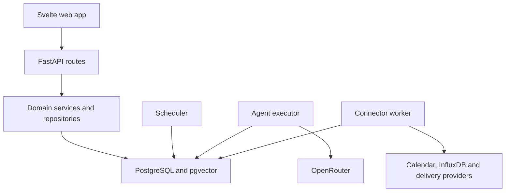
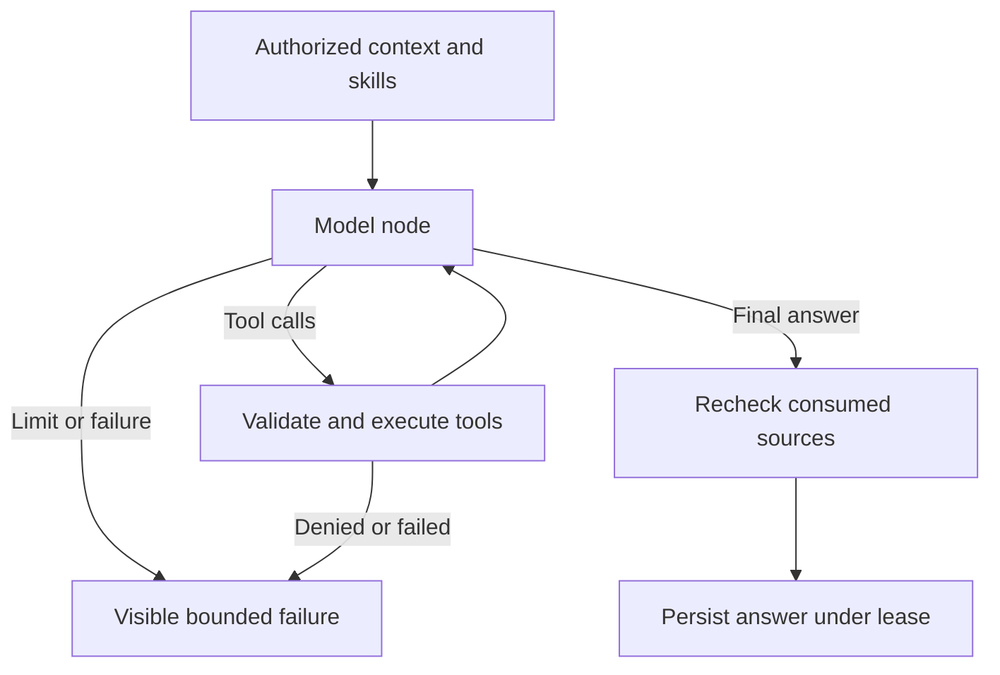
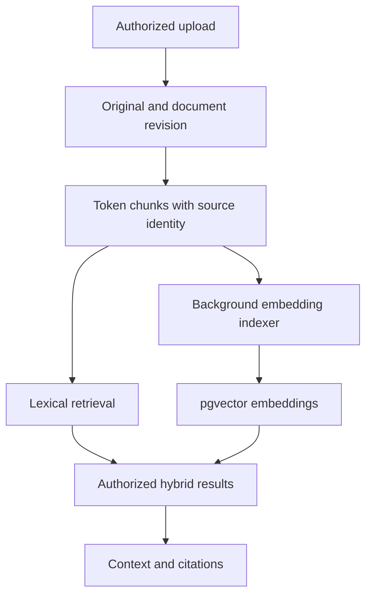

# Architecture and execution flow

This document describes the implemented service boundaries. [CODE_MAP.md](CODE_MAP.md) lists classes, public methods and HTTP routes by source file. [SCHEMA.md](SCHEMA.md) maps ORM records to tables. The product is one enterprise per installation; adding tenants would require an explicit tenant partition throughout queries, jobs, credentials and retrieval.

## Components and scaling boundaries

The Svelte frontend talks to FastAPI under one origin. Routes authenticate the caller and parse input. Domain services own workflows. Repositories centralize resource access. SQLAlchemy models and Alembic migrations define persistent invariants. PostgreSQL stores both business records and bounded LangGraph checkpoints; pgvector lives in the same database.

The API, scheduler, executor, connector and meeting workers use the same image but separate processes. A slow report does not execute inside the scheduler's due-work scan. Database row claims, lease tokens and idempotency keys define ownership; adding workers must preserve those contracts. This is a single-host deployment, not a claim of high availability or benchmarked horizontal throughput.

## Core concepts

| Object | Meaning |
| --- | --- |
| Scope | Organizational node with a configurable display label and parent |
| Workspace | Shared audience, knowledge and collaboration attached to a scope |
| Membership | Explicit user role within a workspace |
| Scope grant/delegation | Summary/review or administrative authority over a defined organizational scope |
| Workspace brief | Versioned operational description and assistant instructions; published revision is loaded deterministically |
| Personal project | Owner-specific organization of notes and conversations |
| User preferences | Canonical timezone, language, units, response style and appropriate personal instructions |
| Skill | Curated procedure/instructions selected for a request |
| Tool | Server-defined function with validated arguments and current authorization checks |
| Connection | Provider configuration plus encrypted credentials and selected resources |
| Agent run | Durable execution request, lease, progress, result and usage |
| Meeting Room | Meeting-scoped participants, evidence, reviewed minutes and distribution |

Workspace membership does not propagate unrestricted raw document access up the organization. Management context follows explicit authorized summaries/publications. The model cannot create grants by interpreting a brief. A personal calendar token is not a workspace automation identity.

## Chat call flow

1. `api_agents.py` accepts a conversation request. `AgentRunService.enqueue_chat()` validates the conversation and request ID and persists the input/run rather than waiting for a long provider call in the browser request.
2. `AgentRunner.claim_one()` claims eligible work with an execution lease. A heartbeat maintains ownership. One conversation cannot acquire overlapping visible answers from competing runs.
3. `ContextService` resolves the audience, published brief, permitted preferences, history and source references. `SkillCatalog.select()` loads relevant curated instructions. `ToolRegistry.schemas()` exposes allowed capability descriptions.
4. `AgentRunner._graph()` constructs the actual LangGraph `StateGraph`. The model may request a bounded sequence of tools. `ToolRegistry.invoke()` validates arguments and reads authorized data through services.
5. The final validation rechecks consumed evidence and audience authority. The answer, references, usage and run result are persisted under the active lease. A stale worker cannot publish after losing ownership.
6. The browser polls run status/events and fetches the final conversation messages. The compatibility `POST /conversations/{id}/messages` uses this same durable execution and returns HTTP 202 with the run when it is queued/retrying; clients should poll its run ID. Cancellation marks the run; subsequent stages honor it. Provider requests already in flight are not magically undone.

`FencedCheckpointSaver` implements LangGraph checkpoint persistence and pending writes. Each checkpoint write locks/checks the current run lease in the same database transaction. Graph execution state is internal; domain records remain authoritative. Do not treat a checkpoint as a permanent grant or inject connector credentials into it.

Terminal chat checkpoint payloads are pruned after the configured retention period (seven days by default); conversation messages, run summaries and active recovery state are retained.

Scheduled analytical jobs reuse `AgentRunner.run_bundle()` and the same graph under their parent job lease. They have durable job retries but do not currently resume every graph node from an independent per-job checkpoint. Explicitly separate this from durable chat-run checkpoint recovery.

## OpenRouter boundary

`services/gateway.py` centralizes model requests, allowed models, tool-call messages, structured outputs, embeddings, timeouts and provider errors. Tool schemas and assistant/tool message IDs preserve the provider protocol. The server executes tools; OpenRouter receives descriptions and results, not direct access to application credentials.

Private chat also exposes explicit-request note/reminder actions through `agents/actions.py`. These reuse `ActionService`, validate the user's quoted intent and an unambiguous timezone-aware deadline, and record idempotent action IDs under the run lease. Workspace chat and scheduled jobs do not inherit these personal write tools. A missing date/time is clarified rather than invented.

The default is remote inference. LangSmith is not required for execution; do not enable external trace export accidentally with deployment environment variables. Model usage and local run events provide application-level visibility.

## Documents and retrieval

`IngestionService.ingest()` validates the destination, extracts text, creates a `DocumentRevision`, retains the bounded original bytes transactionally, and writes source-linked chunks. Revisions prevent old citations from silently referring to changed text. The initial lexical path remains available before embeddings are ready.

`KnowledgeIndexer.run_once()` claims a pending revision, sends authorized chunks through the configured embedding profile, records vectors/model/dimensions and marks progress or errors. It does not discard original documents on provider failure. Tokenization uses a cached encoding baked into the container image.

`RetrievalService.search()` performs authorized lexical/vector candidate retrieval. `search_hybrid()` obtains an approved query embedding and merges results. Source references retain document/revision/chunk identity. Permission restrictions apply to candidates and returned results, not just display labels. A vector match never makes an unauthorized document accessible.

Vectors always live in PostgreSQL. With `VECTOR_BACKEND=qdrant`, `KnowledgeIndexer` also upserts each batch into a Qdrant collection (one per embedding dimension, payload: audience, document, revision, project, model) and removes the document's older revisions; `search_hybrid()` asks Qdrant for candidate chunk IDs inside the caller's audience and `search()` keeps only those that pass the SQL audience/current-revision filter. Qdrant is therefore a rebuildable index (`python -m app.knowledge_cli qdrant-sync`), never an authority. With the default `pgvector` backend, ranking happens in PostgreSQL as below.

Use one vector store, with scope/audience filtering. The current HNSW profile targets the configured supported dimension; changing embedding dimensions is an indexing/schema decision, not a switch that can reinterpret existing vectors. Use `python -m app.knowledge_cli backfill` to index retained 1.0 document text without reuploading. Their original files remain unavailable until a new original is uploaded.

## Personal assistant flow

`CaptureService` saves the original note and interprets it through a bounded classification request. It links proposed/accepted memory, tasks and reminders to the capture. A classification error leaves the original usable. `ActionService` provides idempotent internal mutations and an action journal. Undo checks for conflicts with later edits.

`OrganizationService` manages preview/apply/undo of filing change sets. `PersonalRoutineService` handles daily check-in prompts and weekly organization. Preferences are the canonical source of timezone and presentation behavior. These routines create application records; they are not always-on microphone listeners or telephony sessions.

For external delivery, `DeliveryService` owns its own outbox and 20-second cancellation deadline. Pending cancellation and dispatcher claim are competing database state transitions. Once an external send may have been accepted, an unknown outcome is not silently retried as a guaranteed unsent message.

## Connections and meetings

`ConnectionService` owns encrypted credentials and connection authorization. The Microsoft adapter handles OAuth/token refresh and calendar/transcript reads. `CalendarSyncService` polls a bounded event window every five minutes and updates occurrence records. Calendar tokens stay in the connection layer. InfluxDB v2 builds bounded structured reads; direct PLC/SCADA protocols are outside the implemented adapter set.

`MeetingService.process_one()` runs bounded durable map/reduce steps in the dedicated meeting worker. Draft requests enqueue work and return progress; stored chunk results survive restart. A cancelled extraction does not delete the original meeting evidence.

`MeetingService` creates a room and verifies participants, imports evidence, drafts structured minutes, validates a reviewed revision, publishes to permitted workspaces and accepts personal packages idempotently. Native Zoom/Teams imports retain provider resource references. Supplied MoM is labelled as supplied evidence rather than fabricated transcript speech.

Publishing minutes is an explicit audience change. Approved shared minutes can remain a durable team artifact while the temporary room is archived. Attendee acceptance does not create an external calendar event unless a separate implemented and authorized operation does so.

Deterministic shift handovers also include unresolved workspace incidents and issues active during the exact shift, with assignees, status, evidence and explicit truncation. A report distinguishes the incident status at generation from historical shift timing.

## Governance and scheduling

Recurring dependencies resolve an exact required occurrence from the producer’s approved schedule anchor; an older successful report cannot substitute for a missing required run. Explicit Run Now graphs use fresh matching timestamps, recorded as `trigger_kind=manual`.

`GovernanceService` manages scoped delegations and analytical job revisions/approval. Approved team work runs under constrained workspace authority with an accountable owner; employee transfer cannot silently lend a former member's private connections to the team.

`OperationalReportService.execute()` performs defined validation, handover or production comparison logic against configured source windows. Numeric rules and metric aggregation are deterministic. The LLM may explain results but does not decide that a missing dataset passed validation or invent a calibrated anomaly probability.

`IncidentService` is the shared publisher for human submissions and approved automatic validation findings. An approved alert rule defines outcomes, consecutive failures, severity and publication. Repeated failures append evidence to one open finding; a resolved episode is not silently reopened. Critical escalation requires explicit approved publication/escalation settings.

A report, incident, approved publication or validation result is a domain event source. Existing incident/publication services remain the authority for audience and escalation. This release uses transactional PostgreSQL records and worker polling rather than introducing a second distributed message broker.

## What remains a separate capability

- Native PLC/Modbus/OPC UA/historian integrations and physical one-way gateways.
- Google Calendar/Meet, recording bots, inbox ingestion and always-on wake words.
- Arbitrary executable user skills, autonomous machine control and arbitrary SQL/Python tools.
- SSO, multi-tenant SaaS partitioning, production HA, a general policy-language ABAC engine and provider-independent action recall.

The existing access checks, explicit grants and scoped roles are enforced. These boundaries make the implemented pilot reviewable without presenting later integrations as already complete.
